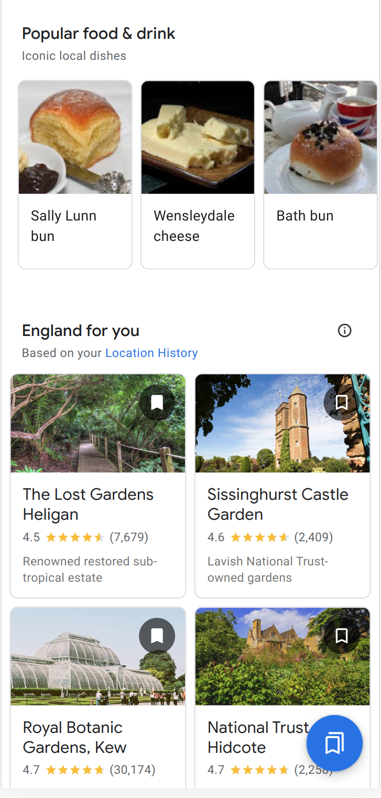

<!-- Global site tag (gtag.js) - Google Analytics -->

# David Eger
Staff Software Engineer, Google 
_Last updated: Oct 2020_

## Google - 2005 - 2020

I joined Google out of graduate school.

At Google I worked on *ranking, recommendation, structured data
extraction,* and *data modeling* to help users find delightful
places in [Google Maps](https://maps.google.com) and [Travel](https://google.com/travel), and relish fine passages in [Google
Books](https://google.com/books).

Most of my development was in C++ or Python or some variant of SQL
augmented with frameworks like [Apache Beam](https://beam.apache.org/)
and pandas.  My favourite tools are interactive environments that let me
dig into data easily &mdash; Jupyter notebooks and (perhaps surprisingly)
Google Sheets.   Interactive tools let you explore large data sets (logs, web signals, reference data sets, code outputs) and give you evidence for the important questions:
+ what might be interesting enough to users to build?
+ what signals might be useful to build into something great?
+ what the heck is wrong with maciej's code?

2012-2020  Google Travel, Maps, Search and Personalization
---------

On Google Travel I ran efforts across Google's Seattle, Mountain View,
New York and Zürich offices to make Google Search and Maps a great
Travel Assistant.

<table>
<tr><td colspan=3 align=center>
<a href="https://youtu.be/gVnnBUZdfoc">Google as Travel Assistant</a>
</tr>
<tr>
<td></td>
<td></td>
<td></td>
</tr>
<tr>
<td>From trip details</td>
<td>to top sights</td>
<td>to dishes to try and bespoke recommendations.</td>
</tr></table>

**Contextualization through Email Understanding** I led a team of great
engineers to build the software Gmail uses to automatically extract flight
and hotel reservations from _free form_ e-mail.  The challenges here were
factoring the problem, putting together a good debugging framework, and
keeping the code fast and contained enough to process billions of emails
a day that we could never observe.  Over my tenure we doubled the recall
of the system to 90-95% and reduced our error rate from 20% down to 1.5%.

The extracted reservations enabled assistance by adding events to the
user's calendar and view of Google Maps so their flight number, status,
and hotel are highlighted when they need it and where they need it.

**All the world's Tourist Attractions, ranked**  I was a team lead for
the group that combined the best of the web with Google's Knowledge Graph to
select which places should show up as attractions and decide how they're ranked
in Google Search and Local Search, as well as how they rank and appear on
the base layer of Google Maps.  This work affect tens of millions of
Search results each day, and led to millions more place sheet opens per
day from Maps and Search as users more easily found the places that would delight.

**Personalized Travel Recommendations**  Though world capitals have
literally tens of thousands of tourist attractions, users don't tend to
look past the first dozen.  For users who opt in to share record their
location with [Google Maps Timeline](https://google.com/maps/timeline),
 we give them bespoke travel recommendations.  Will Bradbury and I launched this work 
to Google's Travel Mobile experience.  Our recommender is based on an embedding model
we developed for attractions combined with training per-user classifiers
based on what the user choses to do &mdash; or not-do &mdash; on their vacations.

**Iconic Local Dishes**
I augmented Google's travel information with dishes that a traveller ought to try when they go to a new country, leveraging the wisdom of the web and pools of local experts found through Google Opinion Rewards.

**Local Search** I ran various projects to improve results for queries
like [beaches near me](https://www.google.com/maps?q=beaches+near+me) and [things to do in bali](https://www.google.com/maps?q=things+to+do+in+bali).  Improvements to
these results came from a variety of efforts: ontology hacking,
fighting spam listings, working with Geo operators to improve Maps
and Knowledge Graph data, and rewriting chunks of the Maps and Search
rendering stacks to better utilize data we already had.

2009-2012  Tesseract OCR, Google Books
--------------------------------------

I worked on the (open source) [Tesseract OCR](https://github.com/tesseract-ocr/tesseract) engine which Google
used to digitize 20 million of the world's books as part of
[Google Books](http://books.google.com/), making millions of
public domain library treasures searchable and downloadable.

My contributions included cutting Tesseract's character error rate
on English by 5% using word bigram patterns, developing Tesseract's Paragraph
detector and adding Bi-Directional OCR support as part of the Tesseract 3.0 release.

2005-2009  Google Checkout, Traffic SRE
--------------------------------------

Google Checkout, the precursor to Google Pay, helped online merchants
process billions of dollars of GMV.  I helped launch Checkout, building
out replication infrastructure and merchant features, diagnosing design
issues, and building the team's production monitoring.

Google's Traffic SRE is responsible for the Terabits of network traffic
entering and leaving Google's production network and edge serving
infrastructure (DNS, HTTP terminators, loadbalancing and Denial of Service
detection and response).

While on the team, I did a lot of the typical Software Engineer and SRE
work: simplifying and automating processes, responding to novel failures
and attacks and figuring out ways to prevent them in the future, and
wherever possible rendering whatever it was I was doing obsolete.

I designed and ran production qualification for DNS rollouts -- including
capacity planning, building failure simulation software, load testing, and
regression testing.  I deployed anycast DNS through Google's production
clusters which consequently made "production maintenance" no longer take
out a rotating set of ten thousand machines every week.

I qualified and rolled out Dave Presotto's proprietary load-balancing DNS
server as Google's primary user-facing DNS `ns[1-4].google.com`.  This
replaced our use of `BIND`, and while I was at it I converted these VIPs to
anycast.  This rollout enabled Google to loadbalance naked domains for the
first time, and as a consequence *reduced user latency by an average of
75ms for 3% of HTTP queries to Google*.

## Patents and public code

**Patent**: [U.S. Patent US8196198B1](https://patents.google.com/patent/US8196198) Access Using Images (2008)

**Code**: [Tesseract OCR engine](https://github.com/tesseract-ocr/tesseract), [The DC3 Suffix Array Creation Algorithm (an implementation)](https://github.com/davideger/dc3) helpful for aligning OCR output with the correct text.

# Pre-Google

## Education
+ PhD Dropout (Programming Languages), Carnegie Mellon University, 2005
+ B.S. in Mathematics, Georgia Tech, 2003  (4.0 gpa)
+ B.S. in Computer Science, Georgia Tech, 2003 (4.0 gpa)

  Graphics coursework under Jessica Hodgins and Compilers with Olin Shivers.
+ Budapest Semesters in Mathematics; Budapest, Hungary 2002

## Awards and Distinctions
+ Fulbright Scholar, Hungary 2003-2004
+ NSF VIGRE Grant Recipient for Summer Research in Mathematics, 2002
+ Albert C Jacobs, Phi '21 Award, 2001
+ Psi Upsilon, Gamma Tau Chapter President, 2000
+ ThinkQuest Gem Award, 1997

## Internships

+ **IBM Extreme Blue Internship** with Austin Research Lab, 2001

    Developed Linux port to and application software for the prototype PowerPC 405LP
    - Wrote PCI and embedded drivers for an LCD Controller
    - Optimized video-related software stack (Linux Framebuffer / Nano-X / FLTK)

+ **HP (nee Convex)**, 2000 bringing up IA64 machines,
+ **IBM Linux Technology Center** fixing glibc PowerPC bugs,
+ **Georgia Tech Animation Lab** porting simulation code from sproc() and POSIX threads and integrating Perl as a scripting library with C++.

